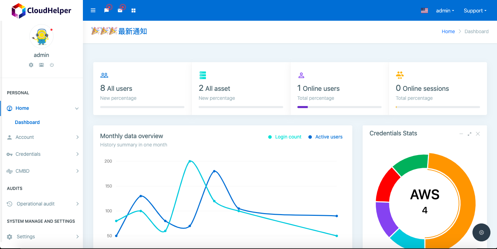
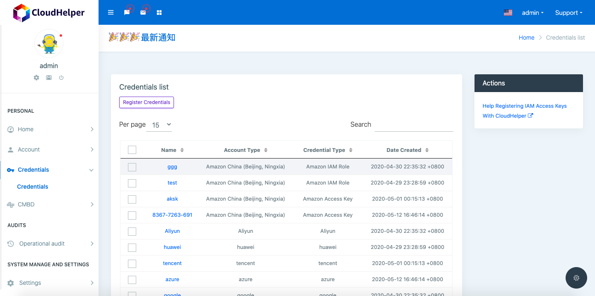
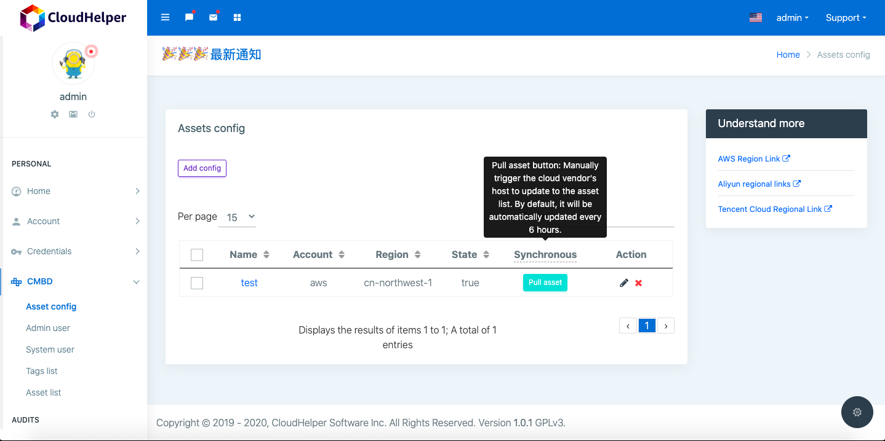

### Thanks to each open source project author for their outstanding contributions to developers around the world

----

### Looking for developers, let us change the world and make some contributions, even a little bit, join in! please contact me: [service@linuxbs.com](mailto:service@linuxbs.com)

### Explanation
[English](README.md) | [中文](README-zh.md)

cloudHelper home

Credentials management page

CMDB management page

* Open source-completely free, quick installation and deployment
* Multi-cloud support-a system can be related to most public clouds in the world

### Product Features
> Features are still being improved...
>
### Product Architecture
> Features are still being improved...
>
### Demo
> Features are still being improved...

### How can I use it?
> Features are still being improved...
>
>

# special thanks
[thank JumpServer](https://github.com/jumpserver/jumpserver.git)

## License

Everything is [GPL v3.0](https://www.gnu.org/licenses/gpl-3.0.html).
